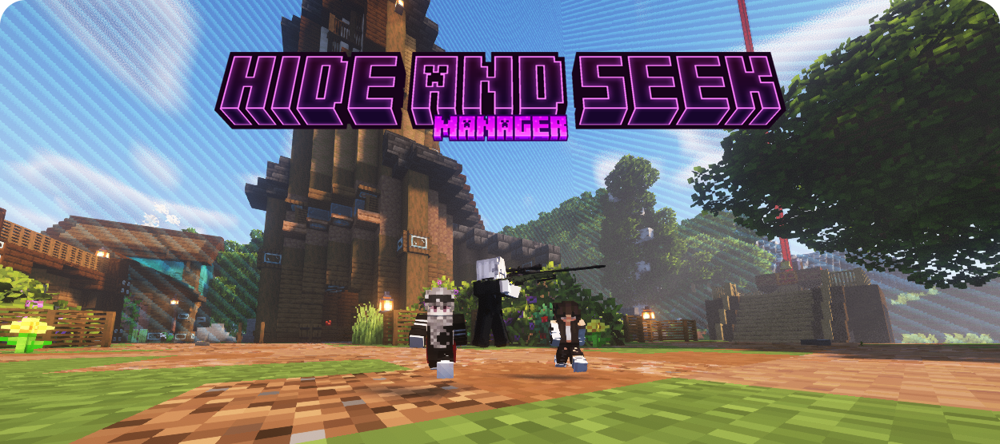
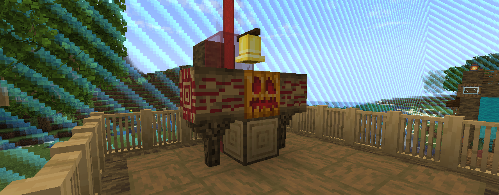

    
      
    To download this mod's JAR file, go to the folder corresponding to your Minecraft version, in this Repository, then navigate to the "build/libs" directory. All JAR versions of this mod will be located there.

# About this Mod

This mod was developed to be the core of modpacks created for playing a Hide'n Seek minigame. As is typical in this game, each player needs to type commands to obtain items, shrink, etc. This mod was created to simplify ALL game management. To play Hide'n Seek with this mod, you must first prepare a world to play in. To prepare the world, follow these steps:

- Make sure the world is already available in your game's world menu.
- Make sure the Commands are active in the world. If they are not, use `NBTExplorer` to activate Commands in the world by editing it directly. Enter the world.
- Find the location where you want the game to take place. In the center of that location, use the commands `/setworldspawn ~ ~ ~` and `/worldborder center ~ ~`. This will make the world's starting point your location.
- Now, set a world border so that the area where players can roam isn't infinite. To do this, use the command `/worldborder set 100`. It's recommended that you use values ​​between 64 and 100, so the playable area won't be too small or too large.
- Turn off the time passage with: `/gamerule doDaylightCycle false`.
- Set a fixed time using: `/time set 3000`. It is recommended to use a time between 1000 and 11500 to ensure it is not nighttime.
- Ensure that Keep Inventory is turned off with: `/gamerule keepInventory false`.
- Turn off Random Tick Speed ​​to prevent the world from evolving, using: `/gamerule randomTickSpeed ​​0`.
- Turn off the Fire Tick using: `/gamerule doFireTick false`.
- Turn off weather cycling using: `/gamerule doWeatherCycle false`.
- Set the default game mode to Adventure. Use: `/defaultgamemode adventure`.
- Build an area of ​​at least 6x6 meters, which will be your base. Place the `Game Totem Head Powered` on this base, similar to the image above. Build it in a way that makes it difficult to access from any angle, so as not to make it too easy for the Hiders. There can only be a maximum of ONE `Game Totem Head Powered` per map.

> [!NOTE]
> If you want the game to generate Adrenaline Injections during the match, simply add at least 2 or more Gold Blocks to the map. These Gold Blocks cannot have anything above them. They will be used to generate the Adrenaline Injections.

Once all the steps are completed, the world will be ready to play Hide'n Seek. To start playing Hide'n Seek, after preparing your world, first open it for LAN so your friends can play with you. At least 2 players are required. Once you're ready to play, simply interact with the `Game Totem Head Powered`. It looks like a Carved Pumpkin!

The game consists of two roles: the `Seeker` and the `Hidder`. As soon as the game starts, you will be informed of your role. The system decides who will play each role, in a 100% random way. After the system informs you of your role, there will be a countdown. During this countdown, the `Hidders` must find a place to hide and stay safe. If they remain too close to the Game Totem, they will be killed. After the game has started, the `Hidders` can approach the `Game Totem Head Powered` again without problems. After the countdown ends, the players must fulfill their roles...

- `Seeker`: The Seeker will receive an Arsenal and must use it to eliminate the majority of the Hidders. If this happens, then the Seeker will win the match.
- `Hidder`: The Hidder will become tiny and must use this size difference to hide. When they feel they can, the Hidder must run back to the `Game Totem Head Powered` and interact with it using the `Right Mouse Button`. By doing so, the Hidder is Saved and can no longer die. If most of the Hidders save themselves, the game ends and they win. The Hidders also receive an Arsenal of Items that may be useful to them. The items are:
  - **Rage Baiter:** Gives you Adrenaline Points, but it emits a standard sound, just like when the Revelation Time ends. The sound's distance is also standard.
  - **Whistle:** Gives you a lot of Adrenaline Points, but it emits a whistling sound that can be heard from a greater distance, and it also reveals itself through walls for a short period of time.
  - **Totem Tracker:** Track the Game Totem Head Powered, displaying it through the walls for a short period of time.
  - **Smoke Bomb:** Throw a Smoke Bomb at your feet. The Smoke Bomb grants you True Invisibility (no particles) for a short period of time and creates a dense sphere of smoke that blocks the vision of everyone inside it. After a short time, it dissipates. While Invisible, you don't make footsteps sounds, but you can lose the effect if you take damage. The Smoke Bomb also grants you the Fall Arrest effect for a short period of time. This effect allows you to fall from a greater height without taking damage.
  - **Zero Gravity:** It gives you the Levitation effect for an extended period of time. Levitation makes you fly upwards slowly, like a puff of smoke. After the Levitation ends, you receive the Slow Fall effect, returning safely to the ground.
  - **Leap of Faith:** It makes you Dash in the direction you are looking. The forward movement is both Horizontal and Vertical.
  - **Camouflage:** It grants you the Invisibility effect for a medium period of time. While Invisible, you don't make footsteps sounds, but you can lose the effect if you take damage.
  - **Ladder Specialist:** This gives you the Ladder Specialist effect for a short period of time. This effect allows you to go up and down stairs more quickly.
  - **Sound Bait:** Allows you to throw a Sound Bait device a long distance. When the device hits the ground, it arms itself, and after a short period of time, it plays a Standard sound, as if a Player were using item 'Rage Baiter'. The throwing distance increases with the time you carry it, just like a Bow.
  - **Breathing Underwater:** It gives you the effect of Breathing Underwater. This effect prevents your oxygen from decreasing while you are underwater.

> [!NOTE]
> With the exception of "Whistle" and "Rage Baiter", all items require `Adrenaline Points` to be used. Adrenaline Points can also be obtained from Adrenaline Injections, which appear above Gold Blocks during the game. Also, during the game, players may periodically provide sound clues to their location, even unintentionally. This is called as `Reveal Time`.

Finally, there is also a score system. Winners receive a total of 5 points for each victory. These points are stored on the Block `Game Totem Head Powered` scoreboard and can be accessed by all Players. To reset the score, simply go to creative mode, break Block `Game Totem Head Powered`, and place it back again.

If you want to see this mod in action, there's a modpack called `Vanilla+ Hide'n Seek 1.20.1` ready to play (in Brazilian Portuguese). This modpack can be installed and played through the `Minecraft+ Launcher`, which can be seen <a href="https://github.com/marcos4503/minecraft-plus">here</a>.

**Configuration:** Several aspects of this mod are configurable. Things like items to be distributed to the Seekers, countdown time, cooldowns, costs, etc.

> [!WARNING]
> This mod was created to be a complete game manager for Hide'n Seek, to be included in Hide'n Seek modpacks. Therefore, if your modpack contains this mod, it cannot be used to play Minecraft normally, such as in Survival mode.

# Compatibility

This mod requires Minecraft Java with Forge Mod Loader installed. You can see the supported Minecraft versions in the folders of this Repository.

Minimum required Forge version:
- For Minecraft 1.20.1 is 47.4.0

# Support projects like this

If you liked the Hide And Seek Manager and found it useful for your, please consider making a donation (if possible). This would make it even more possible for me to create and continue to maintain projects like this, but if you cannot make a donation, it is still a pleasure for you to use it! Thanks! 😀

 

    

